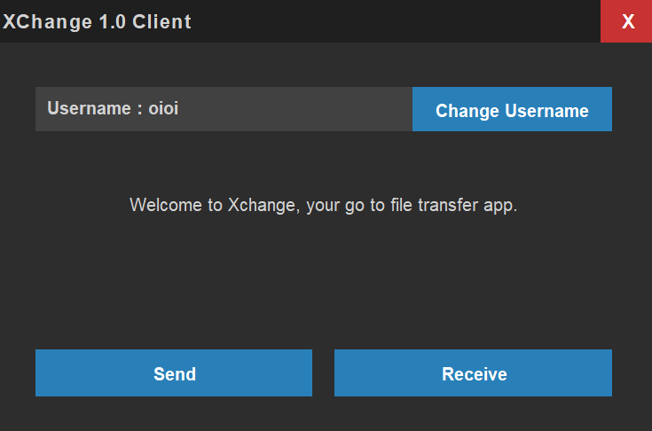
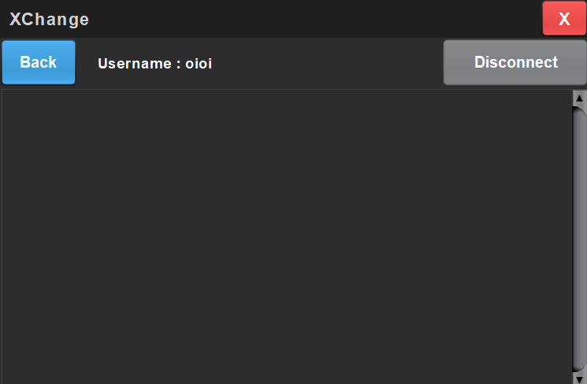
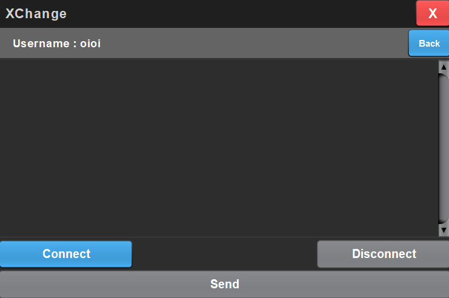

# XChange

**Overview** 
XChange is a Java application that enables secure, fast and user-friendly file transfer between two devices connected on the same local network, eliminating the need for an internet connection.

**Features**  
i.   FILE TRANSFER OVER LOCAL NETWORK: Crucial resources sharing becomes impossible.  
ii.  FILE TRANSFER OF ANY SIZE: Supports file transfer be it large or small files.  
iii. FRIENDLY UI: Minimal and simple UI makes it easier for the user.  
iv.  SHOWS FILE TRANSFER STATUS: Track the progress of file transfer along with speed and time taken.  
v.   CONNECTION CAPABILITY: Connect to a device in the same local network to initialize file transfer.  
vi.  FILE TYPE COMPATIBILITY: Files can be sent of multiple types such as, image, text, video etc.  

**Installation**  
-> Java Runtime Environment (JRE) version 8 or higher.  
-> JDK version 19 or higher.  
-> Java Swing library for Socket Programming.  
-> JavaFx graphical library.  
-> Any Java IDE (e.g. Intellij Idea, Eclipse) is preferable.  

**Steps**  
1. Download the zip file of the project (Network4.3) or clone the git repository.  
  (bash script: `git clone <url of the repository>`)  
2. Open the folder in a workplace (any IDE or code editor) and make sure to do the initial setup  
3. Run the `MainFrame.java` file

## Screenshot

  
    
  <em>Main Menu</em>
    
    
  
    
  <em>File Receiving Window</em>
    

    
  
    
  <em>File Sending Window</em>
    

**Scope**  
=> Multiple server can connect to multiple clients  
=> Fast, efficient file transfer without any use of internet
